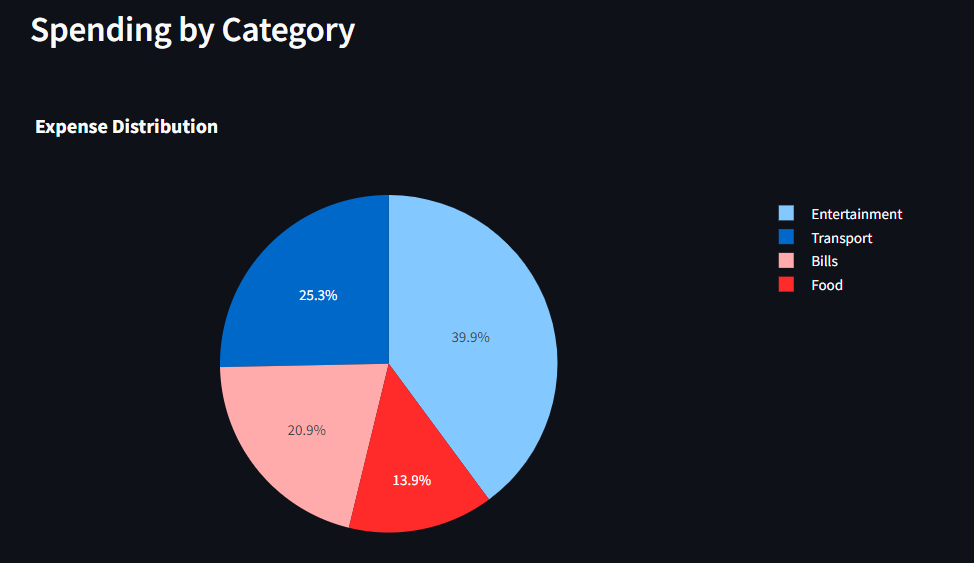
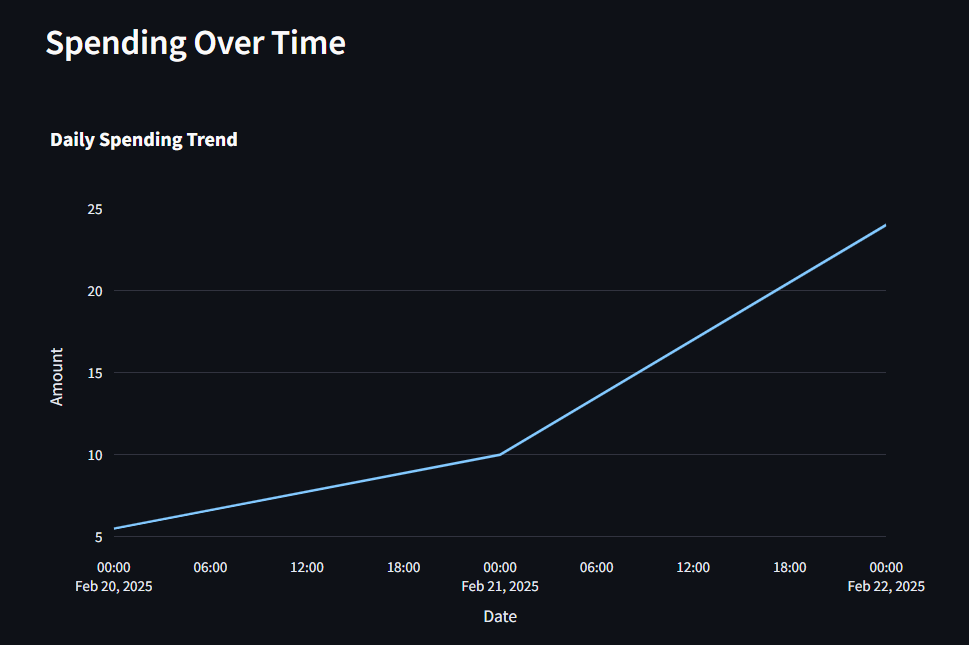

# 🌱 Personal Expense Tracker: A Growth Mindset Adventure  
*Built with Streamlit for the Growth Mindset Challenge*  

[](https://your-app-url-here.streamlit.app)  
*Live Demo: [Click here to try it!](https://your-app-url-here.streamlit.app)*  
*Published: February 22, 2025*  

---

## 🚀 Welcome to the Journey!  
Hey there, growth seeker! Ready to take control of your finances *and* your mindset? This **Personal Expense Tracker** isn’t just an app—it’s a challenge to *embrace obstacles*, *learn from mistakes*, and *persist through difficulties*. Built with Python, Streamlit, and a dash of curiosity, this project proves that every line of code (and every dollar spent) is a step toward becoming better.  

Inspired by Carol Dweck’s *growth mindset*, this app helps you track expenses, visualize spending, and set goals—all while reminding you: *effort > perfection*. Let’s dive in!

---

## 🌟 What’s This All About?  
This Streamlit app lets you:  
- **Add Expenses:** Input date, amount, and category manually (because every small step counts).  
- **Upload CSVs:** Got a spending list? Drop it in and watch the magic happen.  
- **Set a Budget:** Define your limit and get a friendly nudge if you overspend.  
- **Visualize Growth:** See your spending habits in a pie chart and line graph—data is your teacher!  
- **Reset & Reflect:** Wipe the slate clean and start fresh, because learning never stops.  

It’s simple, practical, and packed with lessons—perfect for the *Growth Mindset Challenge*.  

---

## 🛠️ How It Works  
Here’s the behind-the-scenes magic:  
1. **Tech Stack:**  
   - *Python* (because it’s the language of growth).  
   - *Streamlit* (for fast, interactive web apps).  
   - *Pandas* (to wrangle your expense data).  
   - *Plotly* (for gorgeous, interactive charts).  
2. **Features in Action:**  
   - Input expenses via a form or upload a CSV (`Date,Amount,Category`).  
   - Set a budget and track your progress in real-time.  
   - Visualize with a pie chart (category breakdown) and line graph (spending over time).  
3. **Mindset Twist:** Every feature encourages reflection—whether it’s tweaking your budget or learning from a buggy upload.  

---

## 🎯 Try It Out!  
1. **Live App:** [Click here](https://your-app-url-here.streamlit.app) to play with it online!  
2. **Run It Locally:**  
   ```bash
   # Clone this repo
   git clone https://github.com/hammadurrehman2006/expense_tracker_using_streamlit.git
   cd personal-expense-tracker
   
   # Set up with UV (or pip)
   uv venv
   source .venv/bin/activate  # On Windows: .venv\Scripts\activate
   uv pip install -r requirements.txt
   
   # Launch the app
   streamlit run expense_tracker.py
   ```
3. **Sample CSV:**  
   Create a file like this to test the upload:  
   ```
   Date,Amount,Category
   2025-02-20,5.50,Food
   2025-02-21,10.00,Transport
   ```

---

## 🌈 Growth Mindset in Action  
This project embodies the challenge’s core principles:  
- *Embrace Challenges:* Debugging Streamlit? Figuring out budgets? You’ve got this!  
- *Learn from Mistakes:* If the CSV upload fails, tweak and try again—it’s all progress.  
- *Persist Through Difficulties:* Keep adding features, even when the code gets tricky.  
- *Celebrate Effort:* Every commit is a win—share your journey!  
- *Keep an Open Mind:* Suggestions? PRs? Bring it on!  

---

## 📸 Sneak Peek  
Here’s what you’ll see:  
  
*Pie chart of spending by category*  

  
*Spending trend over time*  


---

## 🤝 Join the Growth Party!  
Got ideas to make this tracker even better?  
- Add a savings goal feature.  
- Style it with your favorite colors.  
- Share your own expense insights!  

Fork this repo, tinker, and submit a pull request. Let’s grow together!  

---

## 📋 Requirements  
To run this locally, you’ll need:  
```
streamlit
pandas
plotly
```
Install with `uv pip install -r requirements.txt` or `pip install -r requirements.txt`.

---

## 🌟 Final Thoughts  
This isn’t just an expense tracker—it’s a mindset shift. Every bug fixed, every feature added, every dollar tracked is proof you’re growing. So, what’s your next challenge?  

*“The journey isn’t about proving your intelligence—it’s about developing it.”*  
Happy coding, and keep pushing forward!  

---

*Created by Muhammad Hammad ur Rehman for the Growth Mindset Challenge, Feb 2025*  
*Reach out: [hammadurrehman7707@gmail.com] | [https://www.linkedin.com/in/mhammadurrehman/]*  

